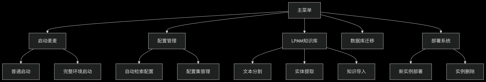
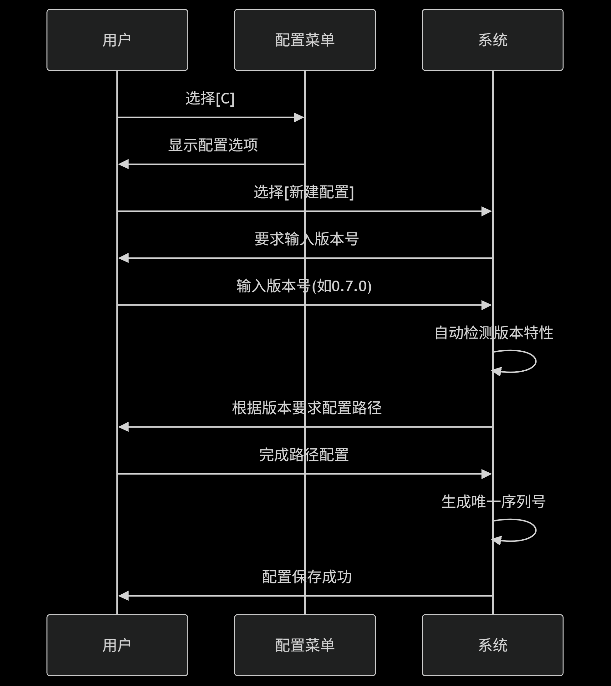
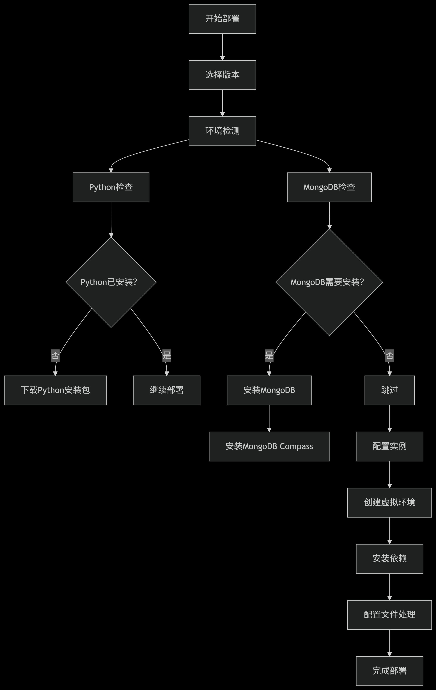
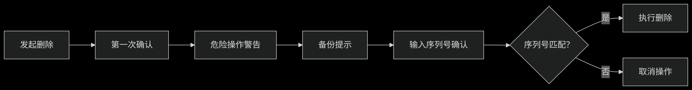

# 由于官方启动器完善，该启动器GUI开发将自今日起无限期停更
> # [官方启动器](https://github.com/MaiM-with-u/mailauncher)
> # [官方启动器后端](https://github.com/MaiM-with-u/mailauncher-backend?tab=readme-ov-file)

# MaiMbot一键启动V3.4.2/V3.4.2-PATH版-适配0.6.2、0.6.3、0.7.0等，同时向下兼容，适配更旧版的麦麦
当前一键启动程序适配最新的0.7.0版本，以及向前兼容所有版本，若后续麦麦的启动原理相同，则同样适配。
V3.4.2-PATH版可将程序的安装目录添加至系统环境变量，支持支持在任何命令行中通过输入`mbl`的方式启动。
# 目录

- [使用说明摘要](#麦麦启动器控制台-新版v342-使用说明摘要)
- [使用说明](#麦麦启动器控制台使用说明-1)
- [更新日志](#更新日志)
- [下载启动器V3.4.2](https://github.com/xiaoCZX/MaiMbot-initiate/releases/tag/v3.4.2)
- [下载启动器V3.4.2-PATH](https://github.com/xiaoCZX/MaiMbot-initiate/releases/tag/v3.4.2-PATH)

# 交流与分享
对麦麦部署有疑问的，可以来我的**麦麦答疑群（1025509724）**（本群禁止接入麦麦），这里不仅有顶级大佬帮你解决问题（还是推荐自己看文档解决），还可以在这里交流分享大家的知识库。

你也可以在**麦麦交流群（902093437）** 接入自己的麦麦进行测试与调整。

同时我也会在**B站**发布部署和配置麦麦的教程。
**[B站主页链接：]** (https://space.bilibili.com/3546384380725382)

# 麦麦启动器控制台 (新版V3.4.2) 使用说明摘要

以下是一份简洁的麦麦启动器使用说明摘要：

---

### 🌈 麦麦启动器使用说明

#### 核心功能：
1. **启动类**：
   - `A`：运行麦麦本体
   - `B`：运行麦麦+NapCatQQ+MongoDB

2. **配置类**：
   - `C`：管理多实例配置（创建/修改/检查）

3. **功能类**：
   - `D`：LPMM知识库构建（文本分割/实体提取）
   - `E`：数据库迁移（MongoDB→SQLite）

4. **部署类**：
   - `F`：实例管理（部署/更新/删除实例）
   - 支持版本：classical/0.6.0~0.7.0/dev/main

5. **关于类**：
   - `G`：查看程序信息/更新日志

6. **退出**：
   - `Q`：退出程序

---

### 🚀 快速上手：
1. **首次使用**：
   - 通过`F`部署新实例（需Git环境）
   - 通过`C`配置路径

2. **日常使用**：
   - 选择`A`或`B`启动麦麦
   - 使用`D`构建知识库

3. **维护操作**：
   - `F`→`C`：更新实例（需Git环境）
   - `F`→`B`：删除不再需要的实例
   - `E`：数据库迁移（旧版→新版）

---

### ⚠️ 重要提示：
1. **路径要求**：
   - 所有路径**不能包含中文**
   - 建议使用英文路径

2. **更新建议**：
   - 更新前**必须备份**：
     - `.env`文件
     - `bot_config.toml`
     - `MaiBot.db`(0.7.0+)
   - 推荐部署新实例而非更新

3. **Git要求**：
   - 实例更新功能需要安装Git
   - [下载Git：](https://git-scm.com/downloads)

---

### ℹ️ 更多信息：
[GitHub仓库：](https://github.com/xiaoCZX/MaiMbot-initiate)

---

# 麦麦启动器控制台使用说明

> # V3.4.2版本启动器功能一浏览

  

# 配置管理系统

> **核心功能：**

  - 多实例管理：支持创建多个独立配置

  - 智能路径验证：自动检测中文路径问题

  - 版本自适应：自动识别新旧版本配置需求

> **操作流程**
  

# 部署辅助系统（新增核心功能）

> **支持版本：**

  - classical

  - 0.6.0-alpha

  - 0.6.2-alpha

  - 0.6.3-alpha

  - 0.6.3-fix3-alpha

  - 0.6.3-fix4-alpha

  - 0.7.0-alpha（最新推荐）

  - dev

  - main

> ## **部署流程：**

  

  **关键步骤说明：**

  1. 版本选择：输入完整版本号（如0.7.0-alpha）

  2. 环境检测：

    - 自动检查Python 3.10+

    - 旧版本自动检测MongoDB

    - 依赖安装：

  3. 自动创建虚拟环境

    - 使用国内镜像加速安装

    - 配置引导：

    - 自动生成配置文件模板

  4. 提示关键配置位置：

    - .env (API密钥)

    - bot_config.toml (核心配置)

    - lpmm_config.toml (知识库配置)

> ## **实例删除功能**

  **安全防护机制：**

  

  **删除内容：**

  1. 麦麦本体程序文件

  2. 适配器程序文件（新版本）

  3. 配置集信息

  4. 保留项：数据库文件（需手动备份）

  >特别提示：0.7.0-alpha/0.8.0-alpha版本的数据库为MaiBot.db文件

### 麦麦启动器控制台使用说明

---

#### 🚀 一、程序概述
麦麦启动器是一款便捷工具，旨在简化麦麦程序的启动流程，并集成相关程序的启动与配置管理功能。用户通过选择不同选项，可实现管理、部署和运行基于MaiBot框架的聊天机器人实例。支持多实例管理、版本部署、知识库构建等功能，提供直观的彩色交互界面。

---

#### 🛠 二、运行环境要求
1. **操作系统**：Windows（已测试Win10/11）
2. **Python版本**：≥3.10（推荐3.12+）
3. **依赖库**：
   ```bash
   pip install toml requests colorama tqdm
   ```

---

#### 📥 三、启动程序
直接运行主程序：
```bash
MaiLauncher-v3.4.2.exe
```

---

#### 🖥 四、主菜单功能说明
程序启动后显示彩色主菜单，包含以下选项：

| 选项 | 功能类别 | 说明 |
|------|----------|------|
| **A** | 启动类 | 仅运行麦麦本体 |
| **B** | 启动类 | 运行麦麦+适配器+NapCat+MongoDB |
| **C** | 配置类 | 管理实例配置（新建/修改/删除） |
| **D** | 功能类 | LPMM知识库构建（文本分割/实体提取） |
| **E** | 功能类 | 数据库迁移（MongoDB→SQLite） |
| **F** | 部署类 | 实例部署/删除辅助系统 |
| **G** | 关于类 | 关于本程序 |
| **Q** | 退出类 | 退出程序 |

---

#### ⚙️ 五、核心功能详解

##### 1. **配置管理 (C)**
- **自动检索**：自动查找本地的麦麦本体和适配器
- **手动配置**：
  - 输入实例版本号（如`0.7.0`）
  - 设置麦麦本体路径（需包含`bot.py`）
  - 设置适配器路径（需包含`main.py`）
  - 配置NapCat路径（可选）
- **配置集管理**：
  - 支持多实例配置（通过序列号区分）
  - 可创建/删除/修改配置

> 💡 提示：路径中**不能包含中文**！

##### 2. **LPMM知识库构建 (D)**
支持知识库构建全流程：
```
文本分割 → 实体提取 → 知识图谱导入
```
- **特殊要求**：仅适用于支持LPMM的版本（如0.6.3+）
- **警告提示**：操作会消耗大量API额度（约40元/600万字）

##### 3. **知识库迁移 (E)**
- **功能**：将旧版MongoDB知识库迁移到SQLite
- **要求**：
  - MongoDB服务必须正在运行
  - 仅支持0.6.3-fix4 → 0.7.0的迁移

##### 4. **实例部署 (F)**
支持部署多个版本实例：
- **经典版** (`classical`)
- **稳定版** (`0.7.0`)
- **最新版** (`0.8.0-alpha`)
- **开发版** (`dev`)
- **主要版** (`main`)

部署流程：
```
1. 选择版本 → 2. 环境检测 → 3. 自动安装依赖 → 4. 配置初始化
```

##### 5. **实例删除**
- **危险操作**：彻底删除实例文件
- **强烈建议**：提前备份重要文件：
  - `.env`（API密钥）
  - `bot_config.toml`（主配置）
  - `MaiBot.db`（0.7.0+数据库）

---

#### ⚠️ 六、注意事项
1. **路径规范**：
   - 所有路径**禁止包含中文**
   - 推荐使用纯英文路径（如`D:\MaiBot`）

2. **环境依赖**：
   - 旧版（<0.7.0）需要安装MongoDB
   - 新版（≥0.7.0）使用SQLite无需额外数据库

3. **首次运行**：
   - 需要同意隐私条款
   - 初始化后需配置`.env`文件中的API密钥

---

#### 🔧 七、故障排查
- **启动失败**：
  1. 检查路径是否包含中文
  2. 确认`bot.py`/`main.py`是否存在
  3. 验证Python版本≥3.10

- **数据库迁移失败**：
  1. 确认MongoDB服务正在运行
  2. 检查迁移脚本是否存在（`mongodb_to_sqlite.bat`）

- **部署中断**：
  1. 确保网络通畅(最好是神秘的魔法环境)（Git clone需要）
  2. 预留10GB+磁盘空间

---

> 🌈 通过本启动器，您可以高效管理多个麦麦实例，构建强大的知识库系统，实现智能聊天机器人的快速部署与运维。建议定期备份重要配置文件以防数据丢失！

如果有BUG，请检查你设置的**执行策略**是否过高，以及确保你有**权限**访问相应的文件夹。
如果还不行，

上上策是询问智慧的小草神，

上策是询问万能的千石可乐，

中策是不用，

下策是询问@joker或@万迦或@一闪（可能会被弔一顿），

下下策是询问一个废物（@小城之雪），

# 更新日志

# V3.4.2

添加并初步完善` [F] → [G]实例更新`功能，添加并完善` [G] 关于本程序`选项

# V3.1.4

修复并优化部署辅助系统

# V3.4

## 一、新增功能

1. 部署辅助系统：

- 支持一键部署多个版本的麦麦实例（包括classical和0.6.0-alpha至0.7.0-alpha）。

- 自动检测并引导安装Python、MongoDB、MongoDB Compass和NapCat。

- 部署过程中可查看所选版本的更新日志。

- 部署完成后自动创建配置集。

2. 实例删除功能：

- 支持彻底删除实例（包括文件删除和配置移除），释放磁盘空间。

3. 彩色输出：

- 使用RGB彩色打印函数，使控制台输出更加美观。

4. 更新日志查询：

- 内置各个版本的更新日志，部署时可查看。

#  二、功能优化

1. 菜单界面优化：

- 重新设计主菜单，按功能分类，并使用彩色标识。

- 配置管理菜单选项使用彩色标识，提升可读性。

2. 配置管理流程优化：

- 新建配置集时，可选择自动检索或手动配置。

- 配置集管理界面显示更详细的信息。

3. 启动逻辑优化：

- 对旧版本（classical）使用run.bat启动，提高兼容性。

- 启动前进行配置验证，确保路径有效。

4. 路径验证增强：

- 检查路径中是否包含中文，避免潜在问题。

5. LPMM知识库构建菜单优化：

- 增加版本提示，避免用户在不支持的版本上使用。

6. 知识库迁移流程优化：

- 增加更多的提示和确认步骤，避免误操作。

## 三、问题修复

1. 修复配置加载时可能出现的异常，避免程序崩溃。

2. 修复旧版本配置中缺少run.bat文件时的错误提示，提供更准确的错误信息。

3. 修复配置集删除功能中可能出现的键错误问题。

4. 修复配置验证逻辑，避免对旧版本误检查适配器路径。

5. 修复启动旧版本时可能出现的路径问题。

##  四、其他

1. 代码重构：

- 将功能模块化，提高代码可读性和可维护性。

2. 引入新依赖：

- 新增requests库用于文件下载。

- 新增zipfile用于解压。

- 新增shutil用于文件操作。

- 新增winreg用于注册表操作（检查MongoDB Compass安装）。

3. 增加错误处理：

- 在关键步骤增加异常捕获，提供友好的错误提示。

## 五、开源许可变更
  开源许可由MIT License变更至Apache License 2.0

> # V3.3

### 重大变更

1. **配置文件格式迁移**：

- 从JSON格式迁移到TOML格式，配置文件名为`config.toml`。

- 支持多配置集（多个麦麦实例配置），每个配置集包含：

- 用户自定义序列号（serial_number）

- 绝对序列号（absolute_serial_number，唯一且自动生成）

- 版本号（version_path）

- 昵称（nickname_path）

- 麦麦本体路径（mai_path）

- 适配器路径（adapter_path）

- NapCat路径（napcat_path）

### 新增功能

2. **多实例管理**：

- 支持创建、删除多个麦麦实例配置。

- 启动时可以选择不同的实例。

- 每个实例可以独立配置，包括版本、路径等。

3. **多版本启动支持**：

- 自动识别版本（通过`is_legacy_version`函数），旧版本（小于0.6.0或classical）和新版本（0.6.0及以上）采用不同的启动方式：

- 旧版本：运行`run.bat`启动。

- 新版本：同时启动麦麦本体和适配器（两个PowerShell窗口）。

4. **知识库迁移工具**：

- 新增`migrate_mongodb_to_sqlite`函数，提供从MongoDB到SQLite的迁移功能（主菜单选项E）。

- 迁移前检查MongoDB服务是否运行，并确认操作。

5. **部署辅助系统（开发中）**：

- 新增`Deployment`函数，提供部署菜单（主菜单选项F），目前功能**开发中**，仅展示占位信息。

### 功能改进

6. **配置管理增强**：

- 合并配置检查和配置编辑功能到配置管理菜单（主菜单选项C）。

- 配置集管理子菜单（新建、删除、重新配置）。

- 新建配置集时，要求输入版本号，并根据版本号决定是否配置适配器路径。

7. **LPMM知识库构建改进**：

- 现在在执行LPMM知识库操作前，需要选择目标实例（配置集）。

8. **路径验证逻辑优化**：

- 针对不同版本进行不同的路径验证：

- 旧版本：检查麦麦路径下是否存在`run.bat`。

- 新版本：检查适配器路径和麦麦路径。

### 问题修复

9. **修复配置加载问题**：

- 增强配置加载的健壮性，当配置缺失时使用默认值。

- 修复配置集切换时可能出现的键错误。

10. **其他优化**：

- 优化用户界面，显示更多配置信息。

- 倒计时函数增加更明显的提示。

### 已知问题

- 部署辅助系统（选项F）目前仅是一个框架，功能尚未实现。

- 在配置管理菜单中，删除配置集时仅通过用户序列号删除，可能不够直观。

### 注意事项

- 升级到新版时，旧版JSON配置将不再兼容，需要重新配置。

- 使用知识库迁移功能前，请确保MongoDB服务已启动。

> # V3.2

> # 一、核心功能扩展

  1. **LPMM知识库支持**
> - 新增LPMM知识库构建专属菜单（选项[E]）
> - 支持知识库一条龙构建流程
> - 支持文本分割、实体提取、知识图谱导入等独立操作
> - 优化了PowerShell命令执行机制，提高稳定性

  2. **界面优化**
> - 重构菜单结构，增加子菜单系统
> - 优化颜色方案，提升视觉体验
> - 改进命令执行状态提示

  3. **安全性增强**
> - 增加LPMM操作的用户确认机制
> - 添加重要操作的警告提示
> - 优化错误处理和恢复机制
  4. **杂项**
> - 新的图标！

> # 二、LPMM功能详解

  1. **知识库一条龙构建**
> - 自动化处理从文本分割到知识图谱导入的完整流程
> - 支持中途暂停和继续
> - 提供详细的进度反馈

  2. **独立操作支持**
> - 文本分割：处理raw_data目录下的文本文件
> - 实体提取：支持多种模型选择，包含资源消耗提示
> - 知识图谱导入：支持多种模型，包含性能需求提示

  3. **用户体验优化**
> - 添加操作确认机制
> - 提供详细的资源消耗提示
> - 支持失败后的重试机制

> # 三、变更明细
  功能模块	    ——    V3.1 → 	V3.2
  
  菜单系统	    ——    单层菜单	→     多层菜单
  
  LPMM支持	    ——    无	    →     完整支持
  
  执行机制	    ——    直接执行	→     确认后执行

  错误处理	    ——    基础提示	→     详细错误信息+重试机制
  
  用户交互	    ——    单向操作	→     交互式操作

> # V3.1

> # 一、 核心改进

  1. **架构重构**
> - 语言迁移：从 PowerShell 脚本 → Python 程序
> - 配置文件：INI 格式 → JSON 格式
> - 模块化设计：使用函数式编程替代过程式脚本

  2. **功能增强**
> - 新增自动路径检索功能
> - 增加配置验证模块（含中文/文件存在性/必要文件检查）
> - 新增配置检查菜单（选项D）
> - 改进虚拟环境激活逻辑
> - 增强跨平台兼容性（保留Windows特性）

  3. **交互优化**
> - 彩色终端输出（使用colorama库）
> - 更友好的错误提示系统

  4. **稳定性提升**
 > - 增强进程检测逻辑（NapCat/MongoDB）
 > - 改进PowerShell调用方式
 > - 增加32/64位系统兼容处理

> # 二、变更明细
  功能模块	 ——    V3.0 → 	V3.1
  
  配置存储	 ——    INI文件	     →     JSON格式
  
  路径验证	 ——   基础存在性检查	 →   多层验证（文件类型/中文/必要文件）
  
  虚拟环境	 ——    硬编码路径	   →     动态路径检测

  进程管理	  ——  简单进程检查	 →     注册表级服务检测
  
  错误处理	 ——    基础提示	    →      详细错误代码+解决方案建议
  
  跨平台支持	 ——  仅Windows	    →   保留Windows特性+部分Unix兼容

> # V3.0：

> 一、功能扩展

  1. 新增启动选项：旧版本仅支持“运行麦麦”和“配置内容”两个基础功能；新版本新增“运行麦麦（同时启动NapCatQQ并检查Mongo DB）”选项，可自动检测NapCatQQ运行状态与MongoDB服务状态，并根据情况执行启动或提示操作，功能更加全面。
  2. 新增退出功能：新版本添加“退出程序”选项，方便用户直接关闭程序，旧版本无此直接退出功能，需手动关闭窗口。
  3.  NapCatQQ路径支持：新版本对NapCatQQ程序路径的处理更灵活，支持路径为空的情况，并在启动时进行针对性检查和提示；旧版本未涉及该程序路径相关操作。

 

> 二、交互优化

  1. 菜单界面：新版本菜单更清晰美观，使用字母A - D作为选项标识，且新增横线、等号分隔元素；旧版本使用数字1、2作为选项，界面相对简洁。
  2. 路径输入：新版本支持将文件夹或路径直接拖入窗口完成输入，无需手动加引号；旧版本仅通过手动输入路径方式，对含空格等特殊字符路径处理不够便捷。

> 三、逻辑与稳定性提升

  1. 错误处理：新版本在错误提示方面更详细，如在选择B选项时，对NapCatQQ和MongoDB的不同状态均有对应提示；运行麦麦时，各步骤错误均有明确回显，且窗口保持打开便于查看问题。旧版本错误提示相对简单，部分场景下可能无法清晰展示错误原因。
  2. 编码设置：新版本明确设置为UTF - 8编码，从根源上避免菜单界面乱码问题；旧版本虽通过`chcp 65001`尝试解决编码问题，但在复杂场景下仍可能出现乱码。
  3. 参数处理：新版本在参数传递和处理上更严谨，减少类似“无法将参数绑定到参数‘FilePath’，因为该参数是空值”等问题；旧版本在复杂路径或参数传递时可能存在潜在逻辑漏洞 。

> 四、技术实现差异

  1. 脚本语言：旧版本基于批处理（.bat）编写；新版本采用PowerShell编写，利用PowerShell强大的系统交互与脚本功能，可更方便地实现任务管理（如检查进程）、服务状态查询（如MongoDB服务）等操作。


> # V2.0：
  **主要：** 进一步修复了配置及启动时不够降智的BUG。
  **次要：** 修复了启动时只启动了一个窗口的问题，将繁琐的配置精简。

> 模块化配置管理：
  - 使用独立的config.ini文件存储配置
  - 配置与代码分离，方便分享和修改
  
> 智能路径验证：
  - 自动验证路径是否存在
  - 支持带空格的路径（无需手动加引号）
  
> 容错机制：
  - 输入验证循环直到输入有效值
  - 自动检测配置文件完整性
  - 友好的错误提示和恢复机制
  
> 用户体验优化：
  - 保留命令窗口查看运行状态
  - 清晰的步骤提示和进度反馈
  
> 兼容性增强：
  - 强制使用UTF-8编码
  - 兼容不同目录结构
  - 自动处理虚拟环境路径

**V2.1:**
- 修复了带空格或特殊字符的路径有时会出BUG的问题。
  
 > 新功能：
  - 现在配置内容时，可以直接将文件夹或文件拖拽进配置窗口以复制文件路径。

> # V1.0：
  主要：修复了原启动方式不够降智的BUG。次要：添加多种修复兼启动方式。

**V1.1：**
**主要** 修复了妃物群主（@小城之雪）智商太高的BUG。

**次要** 修复了一键启动的目标文件检索问题。

**新增** 无论何种（完全变量或基础变量）方式，麦麦运行成功一次后，第二次运行麦麦仅需双击一键启动文件夹中的run_both.bat文件即可。

# Maibot-Chat

**促进多元化艺术创作发展普及**
```
88b         d88           88 888888ba                                ,ad88ba,  88                                
888         888           "" 88    "8b            88                d8"'  `"8b 88                    88     
888b       d888              88    ,8P            88               d8'         88                    88     
88 8b     d8'88 ,adPYYba, 88 88aaaa8P'  ,adPYba,  88MMM            88          88,dPPYba,  ,adPPYba, 88MMM  
88 `8b   d8' 88 ""    `Y8 88 88“”“”8b, a8"    "8a 88     aaaaaaaa  88          88P'    "8a ""    `Y8 88     
88  `8b d8'  88 ,adPPPP88 88 88    `8b 8b      d8 88     “”“”“”“”  Y8,         88       88 ,adPPPP88 88     
88   `888'   88 88,   ,88 88 88    a8P "8a,  ,a8" 88,               Y8a.  .a8P 88       88 88,   ,88 88,    
88           88 `"8bdP"Y8 88 888888P"   `"YbdP"'   "Y888             `"Y88Y"'  88       88 `"8bdP"Y8  "Y888  
```

